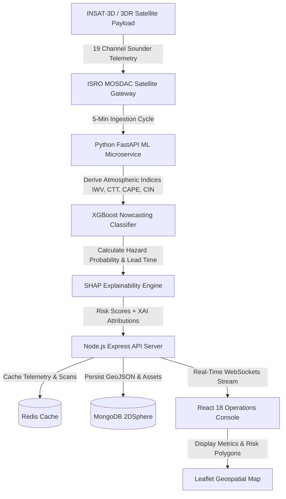

# SANKET — Hyper-local Severe Weather Nowcasting System

**SANKET** is an AI-driven, hyper-local severe weather nowcasting system engineered to predict micro-scale cloudbursts, flash floods, severe thunderstorms, and hailstorms with lead times up to 45 minutes by ingesting real-time ISRO MOSDAC INSAT-3D/3DR satellite sounder telemetry.

---

## 1. Technologies Used

### Programming Languages

- **JavaScript (ES2023 / Node.js)** — Full-stack application logic, asynchronous streams, API routes, and interactive UI component state.
- **Python 3.11** — Machine learning inference, mathematical atmospheric modeling, and SHAP explainability calculations.
- **HTML5 & CSS3** — Canvas animations, glassmorphic layout tokens, and responsive design.

### Frameworks & Libraries

- **Frontend UI & State**: React 18, Redux Toolkit, React Query (`@tanstack/react-query`), Framer Motion, Material-UI, Tailwind CSS, Lucide React icons.
- **Geospatial Mapping & Data Visualization**: Leaflet.js, React-Leaflet, Recharts (Atmospheric trajectory & SHAP attribution charts).
- **Backend API & WebSockets**: Node.js, Express.js, Socket.io (Real-time telemetry broadcasting), JWT (`jsonwebtoken`), Axios.
- **Machine Learning & Data Science**: Python FastAPI, XGBoost Classifier, SHAP (SHapley Additive exPlanations), Pandas, NumPy, Scikit-Learn.

### Databases & Caching Layer

- **MongoDB (Geospatial)** — GeoJSON 2DSphere spatial indices for hazard risk polygons, affected region bounds, and infrastructure asset locations.
- **Redis** — High-performance in-memory cache store for 5-minute satellite scan packets and WebSocket event broker.

### DevOps, Web Servers & Containerization

- **Docker & Docker Compose** — Multi-container orchestration (`frontend`, `backend`, `ml-service`, `mongodb`, `redis`).
- **Nginx** — Production reverse proxy and static asset delivery server forwarding `/api/` and `/socket.io/` routes.

### Hardware & Data Infrastructure

- **Satellite Payload Source**: ISRO MOSDAC INSAT-3D / INSAT-3DR 19-Channel Sounder & Imager Payload.
- **Target Deployment Hardware**: Cloud Virtual Machines (Ubuntu/Linux), Edge Compute Nodes, and Multi-Core Operations Workstations.

---

## 2. Methodology & Process for Implementation

### System Architecture & Data Flow Diagram

---

### Implementation Process Step-by-Step

#### Step 1: Satellite Data Ingestion & Parameter Extraction

1. The system connects to the satellite data stream on a **5-minute cadence**.
2. Derived atmospheric physical parameters are extracted:
   - **IWV (Integrated Water Vapor, mm)** — Water vapor accumulation in the atmospheric column.
   - **CTT (Cloud Top Temperature, Kelvin)** — Deep convective cloud overshoot indicator.
   - **CAPE (Convective Available Potential Energy, J/kg)** — Atmospheric instability measure.
   - **CIN (Convective Inhibition, J/kg)** — Energy barrier suppressing convection before cloudburst.

#### Step 2: Machine Learning Inference & SHAP Explainability

1. The extracted parameter matrix is passed to the **XGBoost Classifier**.
2. The model outputs:
   - **Primary Hazard Classification**: Cloudburst, Flash Flood, Severe Thunderstorm, or Hailstorm.
   - **Severity Level**: `CRITICAL`, `WARNING`, `WATCH`, or `NORMAL`.
   - **Estimated Early Warning Lead Time**: Up to 45 minutes before touchdown.
3. The **SHAP TreeExplainer** computes feature attribution values quantifying the exact contribution of each parameter to the prediction score.

#### Step 3: Geospatial Indexing & Asset Proximity Scoring

1. Active hazard boundaries are formatted into **GeoJSON Polygons**.
2. Critical infrastructure assets (hydro dams, power grids, telecom towers, bridges, hospitals) are queried using MongoDB `2dsphere` spatial coordinates (`$near` / `$geoWithin`).
3. Distance matrix calculations compute exact proximity from assets to severe storm cells.

#### Step 4: Sub-Second WebSocket Broadcast & Operations Console

1. **Socket.io** broadcasts live telemetry packets and critical hazard alerts directly to connected frontend clients.
2. The **React 18 Operations Console** renders:
   - Real-time telemetry gauges and trajectory area graphs.
   - Interactive Leaflet map with hazard polygons and asset markers.
   - 24-hour timeline replay slider to scrub through storm history.
   - Emergency alert center with officer acknowledgment tracking.

---
