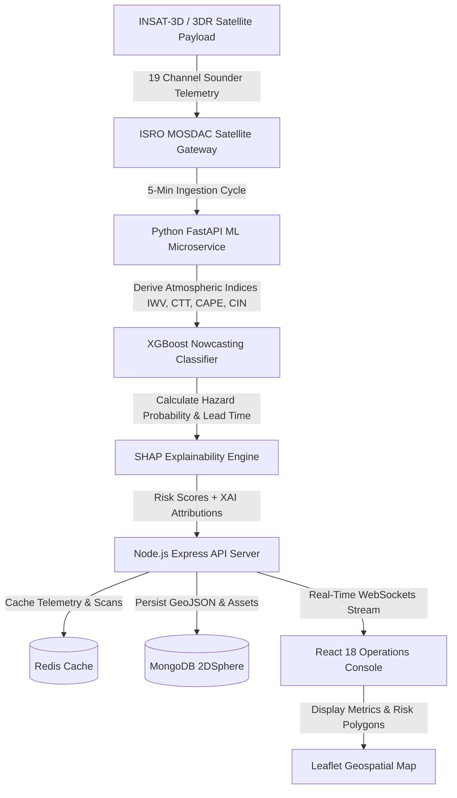

# SANKET — Hyper-local Severe Weather Nowcasting System

**SANKET** is an AI-driven, hyper-local severe weather nowcasting system engineered to predict micro-scale cloudbursts, flash floods, severe thunderstorms, and hailstorms with lead times up to 45 minutes by ingesting real-time ISRO MOSDAC INSAT-3D/3DR satellite sounder telemetry.

---

## 1. Technologies Used

### Programming Languages

- **JavaScript (ES2023 / Node.js)** — Full-stack application logic, asynchronous streams, API and Auth routes, and interactive UI component state.
- **Python 3.11** — Machine learning inference, mathematical atmospheric modeling, and SHAP explainability calculations.
- **HTML5 & CSS3** — Canvas animations, glassmorphic layout tokens, and responsive design.

### Frameworks & Libraries

- **Frontend UI & State**: React 18, Redux Toolkit, React Query (`@tanstack/react-query`), Framer Motion, Material-UI, Tailwind CSS, Lucide React icons.
- **Geospatial Mapping & Data Visualization**: Leaflet.js, React-Leaflet, Recharts (Atmospheric trajectory & SHAP attribution charts).
- **Backend API & WebSockets**: Node.js, Express.js, Socket.io (Real-time telemetry broadcasting), JWT (`jsonwebtoken`), Axios.
- **Machine Learning & Data Science**: Python FastAPI, XGBoost Classifier, SHAP (SHapley Additive exPlanations), Pandas, NumPy, Scikit-Learn.

### Databases & Caching Layer

- **MongoDB (Geospatial)** — GeoJSON 2DSphere spatial indices for hazard risk polygons, affected region bounds, and infrastructure asset locations.
- **Redis** — High-performance in-memory cache store for 5-minute satellite scan packets and WebSocket event broker.

### DevOps, Web Servers & Containerization

- **Docker & Docker Compose** — Multi-container orchestration (`frontend`, `backend`, `ml-service`, `mongodb`, `redis`).
- **Nginx** — Production reverse proxy and static asset delivery server forwarding `/api/` and `/socket.io/` routes.

### Hardware & Data Infrastructure

- **Satellite Payload Source**: ISRO MOSDAC INSAT-3D / INSAT-3DR 19-Channel Sounder & Imager Payload. (Using only Sounder due to relevance to the project)
- **Target Deployment Hardware**: Cloud Virtual Machines (Ubuntu/Linux), Edge Compute Nodes, and Multi-Core Operations Workstations.

---

## 2. System Architecture & Data Flow Diagram

---

## 3. MVP Link

Render Deployed Link: <https://sanket-kcba.onrender.com/>
